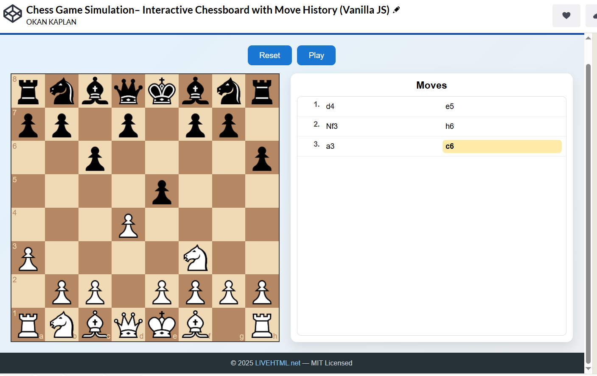

# ♟️ Chess Game UI Max  
### Interactive Chessboard with Move History (Vanilla JavaScript)

**Chess Game UI Max** is a clean and professional **interactive chess game** built with  
**pure HTML, CSS, and Vanilla JavaScript** — no frameworks, no build tools.

It features a responsive chessboard, structured move history with **separate white and black moves**, active move highlighting, and replay functionality, wrapped in a modern UI with header and footer branding.

🔗 **Live Demo:** https://livehtml.net

---

## ✨ Features

- Interactive chessboard (drag & drop)
- White / Black move separation
- Active move highlight
- Move history replay
- Responsive layout (desktop & mobile)
- Clean and extendable codebase
- No frameworks (Vanilla JS only)

---

## 🛠️ Tech Stack

- HTML5  
- CSS3 (Flexbox, Responsive UI)  
- Vanilla JavaScript  
- chess.js  
- chessboard.js  

---

## 🎯 Use Cases

- Frontend practice & demos  
- UI / UX showcase projects  
- Educational JavaScript examples  
- Open-source learning  
- Portfolio projects  

---

## 📜 License

This project is licensed under the **MIT License**.  
See the [LICENSE](LICENSE) file for details.

---

## 👤 Author

**Okan Kaplan**  
🌐 https://livehtml.net
